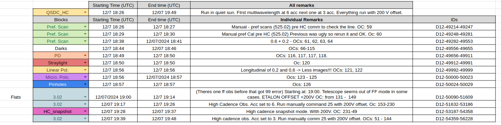

# Working with TuMag's data. 

TuMag data is stored in the SPG's server in "work/obs/TuMAG_data" and stored in different directories depending on the the day and hour of the observation. 

To identify the images belonging to scientific observations, all observation-related images of TuMag have been assigned a unique ID. The ID's have the structure: DXX-YYYY. Where the DXX stands for the day of the measurement: (D09, D10, D11, ... , D16), and YYYY is a cardinal number to identify the specific image within that day. 

There is a csv file for each day where all images are labeled with the specific path to the image within the server. The files are provided in this repository in the the [Organized files](../Organized_files/) folder. 

To identify an image just go to the csv file corresponding to the "DXX" and search the image labeled with YYYY. 

#### <ins>Example</ins>

Image: D11-102. 

From file [D11.csv](../Organized_files/D11.csv#L103) in line 103 (ID's start at 0):
- 102,/work/obs/TuMAG_data/2024_07_11_00_00_00_123/2024_07_11_00_00_00_123/2024_07_11_00_00_46_792_0_9221.img


## Identifying observations. 

All observations are recorded in the [TuMag's Logbook](TuMagCompass.csv) file. All timelines are detailed in the file with all the observation and calibration blocks indicated. 

Every observation block has a column where the ID's are noted down. The format of labelling the observation block is "DXX-YYYY-ZZZZ". This indicates that the images composing the observation range from the image DXX-YYYY to DXX-ZZZZ, including all images in between. Some times different querys appear in these cells, meaning that the images are separated.

Please read the remarks (sometimes difficult to understand even for the one who wrote them...)because sometimes observations are aborted, calibrations fail, etc...   

#### <ins>Example of labeled timeline</ins>



If working locally, just download the data and you are good to go! 

## Working in SPG' server (recommended). 

If you want to work directly on the server there are a few tools that allow you to use the indexes smoothly.

In the first place, ensure you have installed the enviroment with the required libraries and activated it. See the [installation guide](Installation.md) for details.

#### <ins>Reading a specific image.</ins>

The [image_handler](image_handler.py) module includes the function: [read_ID](image_handler.py#L258). Provided with an index of an image returns the Image (2D numpy array) and its header. 

- Example of use:
```python
I, H = image_handler.read_ID("D11-1917")
```
Please refer to the function for more info. 

#### <ins>Obtaining the paths of multiple images.</ins>

The [image_handler](image_handler.py) module includes the function: [get_images_paths](image_handler.py#L216). This function returns the paths of the images between two indexes of a specific file. It can be given multiple queries if images from different files are required.

- Example of use:
```python
paths = image_handler.get_images_paths([["D11-1917-5620"], ["D12-302-17000"]])
```
or 
```python
paths = image_handler.get_images_paths("D11-1917-5620")
```

The paths variable will include all paths for the images between index 1917 and 5620 of file "D11.csv" and from 302 to 17000 of file "D12.csv" in the first example. 

#### <ins>Reading a specific image from terminal:</ins>

The module [Check_image_id](Check_image_id.py) can be called in the terminal line to read an image given an image index. By default it only prints the observation mode and counter. But if the word "plot" and/or "header" is added to the command line will also plot and print the header, respectively.

- Example of use:
```shell
python3 Check_image_id.py D11-1500 plot header
```