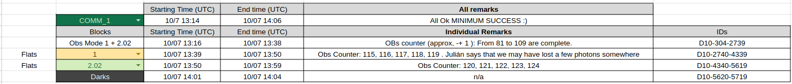
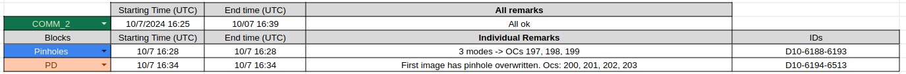

# Correcting observations

The standard procedure of dtaa correction is the following:
1. Compute the **dark current** (DC).
2. Compute the **flat-fields** (FFs). 
3. Process the observation mode.
4. Apply the flat-field correction.
5. Filter and align modulations and cameras.   
6. Demodulate. 
7. Correct X-talk. 

Let's go over these steps in the case of the minimum success observations (Comm 1 + Comm 2 timelines.)

## Identifying images.

To identify the images belonging to each block (calibration and scientific observations) use the [logsheet](https://docs.google.com/spreadsheets/d/1RJ5KIgxMN6B-1xDe9gRfoTh1L_uTDMbZw0ajLK6S0so/edit?usp=sharing) and the corresponding file from the [Organized files](../Organized_files/) directory. 

The minimum success observations are composed of timelines: Comm 1 and Comm 2, and consist of:
1. Dark set observations
2. Flat fields for Observing mode 1 and 2.02
3. Observation block of 1 + 2.02
4. Pinholes
5. Phase diveristy observations. 

From the logsheet:




The images are identified through the following indexes: 
```python
flats_obs1_index = "D10-2740-4339"
flats_obs2_index = "D10-4340-5619"
darks_index = "D10-5620-5719"
pinholes_index = "D10-6188-6193"
obs_index = "D10-304-2439"
```

All routines of the pipeline require the paths to the images. There are two ways of working with this: 

1. <ins>Working in the IAA's server.</ins>

If working on the IAA's server, the paths can be obtained directly with the indexes and the routine [get_images_paths](../image_handler.py#L230) from the module [image_handler.py](../image_handler.py) : 

```python
dark_paths = ih.get_images_paths(darks_index)
ff_obs1_paths = ih.get_images_paths(flats_obs1_index)
ff_obs2_paths = ih.get_images_paths(flats_obs2_index)
pinholes_paths = ih.get_images_paths(pinholes_index)
obs_images = ih.get_images_paths(obs_index)
```
2. <ins>Working locally.</ins>

If working on a local machine you will need to identify the images with te corresponding file from the [Organized files](../Organized_files/) directory, download the data, and generate the paths of your machine. <ins>**Remember to provide them sorted!** </ins>

If stored in separate folders this can be achieved with the [glob](https://docs.python.org/3/library/glob.html) module by: 
```python
darks_paths = sorted(glob.glob("path/to/darks/directory/*")
```
There are other ways but remember to sort them out. 

## Compute the **dark current**

To generate the dark current use the function [compute_master_dark](../master_dark.py#L18) from the module [master_dark.py](../master_dark.py):

```python
dc = compute_master_darks(dark_paths, verbose = True)  
```
The compute_master_darks only requires the images paths as an input. 

The dark current (variable dc) is an array of shape (2 x 2016 x 2016) - (camera, size x, size y). 

The dark current is given per acumulation. 

<ins>Note:</ins> The verbose entry for all functions is used to print info on the terminal. Set it to False or don't use it if no info is wanted.

## Compute the **flat-fields**

To generate the flat-field use the function [compute_master_flat_field](../master_flatfield.py#L15) from the module [master_flatfield.py](../master_flatfield.py):

```python
ff_data, ff_info = compute_master_flat_field(ff_paths, dc = dc, verbose = True)
```

The function compute_master_flat_fields requires the paths to the flats observation and the dark current. Only flat-fields of one observing mode can be provided for each execution of the function. 

<ins>Note:</ins> Currently, if one observing mode is incomplete (there is some image missing) the routine will fail. 

The function returns two variables:
1. ff_data : A numpy array of shape (2 (cams) x Nlambda x Nmods x 2016 x 2016) with the normalized flat fields.
2. ff_info : A dictionary containing information of the observing mode and images headers.

## Process the observation.

Observation blocks of TuMag observations are composed of multiple observing modes in two modalities: A single observing mode repeated throughout the whole observing block, or a c.ombination of two observing blocks that are run by pairs In any case, before processing the observation, it is required to identify the complete observing modes as some may have been aborted, failed, etc.. 

To identify the observing modes within an observing block use the function [separate_ocs](../image_handler.py#L300) from the [image_handler.py](../image_handler.py) module:

```python
OCs = image_handler.separate_ocs(obs_images, verbose = True)
```

This function only requires the paths to the images that compose the observation block but is highly recommended to use the verbose = True to read the information. 

This function reads all images headers and separates the images using the **Observation Counter** field of the headers. If the verbose is set to True, a list including all observation counters, their corresponding observing mode and the number of images is printed in terminal.

Identify an observation mode that is complete to process. 

To read the images and process them automatically use the class [nominal_observation](../image_handler.py#L104) from the [image_handler.py](../image_handler.py):

```python
ob_fe = ih.nominal_observation("2.02", OCs[82]["ims"], dc)
```

This functions requires the observing mode to process from the list: [0s, 0p, 1, 2.02, 2.06, 3.02, 3.06, 4, 5.02, 5.06], the paths of one observing mode. This can be given manually or using the OCs varibale from the [separate_ocs](../image_handler.py#L300) function using the observation counter to identify the obserevation mode, and lastly, the dark current. 

It returns a class, containing all info of the observing mode, data and informations. 

To obtain the data:
```python
ob_fe_data = ob_fe.get_data()
```
This returns an array of shape : (2, Nlambda, Nmods, 2016, 2016)

To obtain the images headers and observation mode information:
To obtain the data:
```python
ob_fe_info = ob_fe.get_info()
```

## Correct the flat-fields

```python
# Correct flats
corrected = np.zeros(np.shape(ob_fe_data))
# Loop over modulations
for mod in range(info_fe["Nmods"]):
    # Loop over wavelengths
    for lamb in range(info_fe["Nlambda"]):
        corrected[0, lamb, mod] = (ob_fe_data[0, lamb, mod]) / ff[0, lamb, mod]
        corrected[1, lamb, mod] = (ob_fe_data[1, lamb, mod]) / ff[1, lamb, mod]
```
Ensure to divide each observation by the flat field of the corresponding wavelngth and modulation.

## Filter and align modulations and cameras. 

After flat-field correction, the dtaa has to be filtered (to remove spurious signals) and aligned before demodulation. 
The function [align_obsmode](../alignment.py) from the [alignment.py][../alignment.py] module performs both tasks:
```python
aligned, _ = alignment.align_obsmode(corrected)
```
The second output of the alignment function are the shifts applied to the data, and are only used to verify the alignment. 

## Demodulation

To compute the stokes parameters use the function [demodulation](../demodulation.py) from the [demodulation.py](../demodulation.py) module. 
```python
demodulated, dual_beamed = demodulation.demodulate(corrected, filt = info_mg["line"])
```
This function requires a numpy array containing the images from both cameras, all modulations and wavelengths in a numpy array, and pre-filter ("517", "525.02" or "525.06"). 

It returns the demodulated array with the same size as the input (demodulated output) and the dual-beamed demodulated array.  

