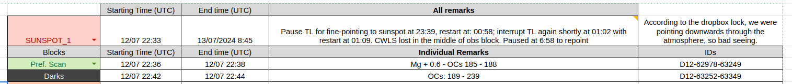

## Pre-filter guide. 

Before removing the pre-filter from the flat-fields, a model has to be generated from the _"prefilter_scans"_ calibration observations.

### Identifying and parsing prefilter scan observations

In the [Tumag's Logbook](https://docs.google.com/spreadsheets/d/1RJ5KIgxMN6B-1xDe9gRfoTh1L_uTDMbZw0ajLK6S0so/edit?gid=812880501#gid=812880501), find closest prefilter scan observation to the observation block. 

Example:


Prefilter scans observations consist on 4 different observing modes: 2 pairs of scans of the lines used in the observation. 

In order to separate the observing modes, use the [separate_ocs](../image_handler.py#L326) function from the [image_handler](../image_handler.py) module or, alternatively use the [Check_ocs.py](../Check_ocs.py) directly in terminal. 

#### Check_ocs.py

From IAA's servers run:
```shell
python ../TuMags_Reduction_Pipeline/Check_ocs.py D12-62978-63249 save
```
**The save keyword is important to store the results in a pickle file of name: "OCS.pickle" to make them accesible for later steps.**

This command should start printing the progress of the image processing on terminal. When finished, an output like this should have been generated:

```shell
Images por mode:
OC : 185 - Obs Mode : Spectral_calibration - Nims : 68 - Incomplete
OC : 186 - Obs Mode : Spectral_calibration - Nims : 68 - Incomplete
OC : 187 - Obs Mode : Spectral_calibration - Nims : 68 - Incomplete
OC : 188 - Obs Mode : Spectral_calibration - Nims : 68 - Incomplete
```
The "Incomplete" keyword dows not mean anythng in this case since spectral scans do not have a pre-established number of images.  

#### separate_ocs module

somewhere in the code run:
```python
ocs = image_handler.separate_ocs(images_paths, verbose = True, flat_fieldmode = False)
```

The images_paths is a list of all the images that want to be processed to be separated into OCS, this can be generated manually if workin in a local machine, or directly with the [get_images_paths](../image_handler.py#235) module from the [image_handler](../image_handler.py) module.
```python
paths = image_handler.get_images_paths("D12-62978-63249")
```

### Processing the prefitler scan

Once the observations have been processed, the measured scan canb be obtained from the [parse_prefilter_scan](../prefilter_removal.py#L154) function from the [prefilter_removal](../prefilter_removal.py):

```python
V_525, I_525 = prefilter_removal.parse_prefilter_scan(ocs[187]["ims"], filt = "525.02", verbose = True)
```

The function needs the paths to the images composing the scan, and the pre-filter. The filt keyword is only passed to ensure that the images used correspond to the given prefilter, if no argument is passed, the first image will be used as reference. 

### Generating the pre-filter model

With the voltages and intensities of the scan, use the [fit_prefilter](../prefilter_removal.py#L209) function from the [prefilter_removal](../prefilter_removal.py) to fit the model:

```python
model_525 = pr.fit_prefilter(V_525, I_525, filt = "525.02", bounds = [(0.6, 0.85), (2.5, 2.6), (5250.3, 5250.9), (0.4, 0.7)],
                             save_flag = True, plot_flag = True, plot_filename = "prefilter_model_25.png")
```

The function needs the voltages and intenisty of the scan, and the filter. Set the save_flag argument to True to store the model in a pickle file to be used during the flat-field computation. If the plot_flag is set to True, a plot with the fitting will be generated with the selected "plot_filename".

The bounds function helps the fitting in case it does not converge in a satisfying result. The bounds change, in order:
 1. The reflectivity of the etalon.
 2. The refractive index.
 3. The center of the pre-filter.
 4. The width of the pre-filter. 

Do not use the bounds keyword if unsure of the values. Default values will be employed. 

### Use the model to generate the flat-fields. 

To use the generated model of the prefilter (stored in a pickle file), set the remove_prefilter keyword to True and provide the path of the model to the [compute_master_flat_field](../master_flatfield.py) funtion of the [master_flat_field](../master_flatfield.py) module:

```python
ff_om2_02 = mff.compute_master_flat_field(flat_field_paths, dc= dc, verbose = True, remove_prefilter=True,
                                          pref_model="path/to/prefilter/model/prefilter_model_525.02.pkl")
```


